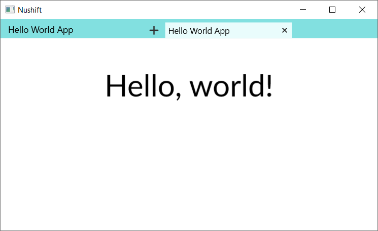

# Nushift

A new shift in running programs with shareable URLs.

<p align="center">
    
</p>

## Overview

Nushift attempts to be an alternative to the web that has the accessibility and shareability of web URLs, but uses different technologies to the web. Apps (or pages) are RISC-V programs, that interact with a syscall ABI defined by us.

The Nushift hypervisor is focused on being small and having a strict API. Visual layout is entirely done by apps themselves, while communicating what is being done through the accessibility tree API.

## SHM

SHM is the main method of communication between apps and the hypervisor. While it stands for "shared memory", this is mainly to distinguish it from IPC, and the ability to share it is limited.

A region of memory is a cap (capability), and this is distinguished from the address it may be mapped into. An SHM cap can only be mapped into one logical thread of execution at a time. To communicate with the hypervisor, an SHM cap is unmapped from the app and mapped into the hypervisor, while the hypervisor is working on it.

## 64-bit versus 32-bit

Currently, RV64IMC is supported. Support for more extensions will almost certainly be added. The hypervisor API expects 64-bit values, and this is likely to remain the case when 32-bit apps are supported. 64-bit values, for the purposes of the hypervisor API, should be encoded into one or multiple 32-bit registers by 32-bit apps.

## Hypervisor ABI

The syscall number is passed in `a0`.

The (optional) first, second, third and fourth arguments are passed in `a1`, `a2`, `a3`, `a4`.

The `ecall` instruction is used to issue the call.

Successful return values are returned in `a0`.

If an error occurs, `a0` is set to `u64::MAX`, and the error code is returned in `t0`.

## SHM API

### ShmType (enum)

`FourKiB` = 0,\
`TwoMiB` = 1,\
`OneGiB` = 2.

These correspond to the page and superpage sizes available in the Sv39 scheme described in the RISC-V privileged specification. Apps, furthermore, currently have access to the Sv39 scheme (39-bit virtual addressing giving a total of 512 GiB virtual space, and 56-bit physical addressing). Support for Sv48 and Sv57, and their associated superpage sizes, may be added in the future.

### ShmNew

Arguments: type (`ShmType`), length (`u64`).\
Returns: shm_cap_id (`u64`).\
Errors: `InternalError`, `Exhausted`, `ShmUnknownShmType`, `ShmInvalidLength`, `ShmCapacityNotAvailable`

Creates a new SHM cap. The size (in bytes) of the backing memory of the cap is the page size (in bytes) represented by the `ShmType` provided multiplied by the `length` provided. For example, `ShmType::FourKiB` and a `length` of `1` produces a cap that logically holds one 4 KiB page, and has a total backing memory size of 4096 bytes.

`length` must be greater than 0.

On current commodity operating systems, mmap is used to reserve the memory when you call `ShmNew`.

### ShmAcquire

Arguments: shm_cap_id (`u64`), address (`u64`).\
Returns: `0u64`.\
Errors: `InternalError`, `CapNotFound`, `PermissionDenied`, `ShmCapCurrentlyAcquired`, `ShmAddressOutOfBounds`, `ShmAddressNotAligned`, `ShmOverlapsExistingAcquisition`

Maps (acquires) the requested cap into the app at the requested address.

`address` must be page-aligned to the page type of the provided `shm_cap_id`, and must be less than 2<sup>39</sup>, due to the current Sv39 scheme.

### ShmNewAndAcquire

Arguments: type (`ShmType`), length (`u64`), address (`u64`).\
Returns: shm_cap_id (`u64`).\
Errors: `InternalError`, `Exhausted`, `ShmUnknownShmType`, `ShmInvalidLength`, `ShmCapacityNotAvailable`, `ShmAddressOutOfBounds`, `ShmAddressNotAligned`, `ShmOverlapsExistingAcquisition`

Calls `ShmNew` and `ShmAcquire` in one system call.

### ShmRelease

Arguments: shm_cap_id (`u64`).\
Returns: `0u64`.\
Errors: `InternalError`, `CapNotFound`, `PermissionDenied`

Unmaps (releases) the requested cap from the app.

Silently succeeds if the requested cap is not currently acquired.

### ShmDestroy

Arguments: shm_cap_id (`u64`).\
Returns: `0u64`.\
Errors: `CapNotFound`, `PermissionDenied`, `ShmCapCurrentlyAcquired`

Deletes a cap.

The cap must be released before destroying, otherwise the error `ShmCapCurrentlyAcquired` is returned.

### ShmReleaseAndDestroy

Arguments: shm_cap_id (`u64`).\
Returns: `0u64`.\
Errors: `InternalError`, `CapNotFound`, `PermissionDenied`

Calls `ShmRelease` and `ShmDestroy` in one system call.

## Exit API

### Exit

Arguments: exit_reason (`u64`).\
Returns: N/A.\
Errors: None

Exits the app.

Upon issuing the `ecall`, no further app instructions will be executed.

The provided `exit_reason` is currently printed to the console.

## Accessibility Tree API

### AccessibilityTreeNew

Arguments: None.\
Returns: accessibility_tree_cap_id (`u64`).\
Errors: `InternalError`, `Exhausted`

Creates a new accessibility tree capability, that can be used to publish an accessibility tree.

### AccessibilityTreePublishRON

Arguments: accessibility_tree_cap_id (`u64`), input_shm_cap_id (`u64`), output_shm_cap_id (`u64`).\
Returns: task_id (`u64`).\
Errors: `InternalError`, `Exhausted`, `CapNotFound`, `InProgress`, `PermissionDenied`

Starts a task to publish the RON-based accessibility tree contained in `input_shm_cap_id`, to the hypervisor.

The format of the data in the cap represented by `input_shm_cap_id` is in [Postcard](https://postcard.jamesmunns.com/wire-format) format, but is a simple string. Hence, it will be a varint-encoded length followed by the string data, as per the Postcard format. The string is an accessibility tree in [RON](https://github.com/ron-rs/ron) format of the schema described in `AccessibilityTreePublish`, and should be easier to use than the `AccessibilityTreePublish` binary version.

As with other deferred-style calls:
* This releases `input_shm_cap_id` and `output_shm_cap_id` and then you can't access them anymore
* It accepts `input_shm_cap_id` and `output_shm_cap_id` that are already released
* The `output_shm_cap_id` cap is created by you, and the hypervisor will write the output of the deferred call to it

An error will be written to the `output_shm_cap_id` cap if the Postcard data cannot be deserialised, or the RON string itself cannot be deserialised. The error begins with the varint-encoded discriminant 1, followed by error details. On success, the varint-encoded discriminant 0 is written. The output format is itself in the Postcard format.

### AccessibilityTreePublish

Arguments: accessibility_tree_cap_id (`u64`), input_shm_cap_id (`u64`), output_shm_cap_id (`u64`).\
Returns: task_id (`u64`).\
Errors: `InternalError`, `Exhausted`, `CapNotFound`, `InProgress`, `PermissionDenied`

Starts a task to publish the accessibility tree contained in `input_shm_cap_id`, to the hypervisor.

The format of the data in the cap represented by `input_shm_cap_id` is in Postcard format. The schema expected is that of `AccessibilityTree` in the following Rust source code:

```rust
// Copyright 2023 The Nushift Authors.
// SPDX-License-Identifier: Apache-2.0

use serde::{Deserialize, Serialize};

#[derive(Debug, Deserialize, Serialize, PartialEq, Clone)]
#[serde(deny_unknown_fields)]
pub struct AccessibilityTree {
    surfaces: Vec<Surface>,
}

#[derive(Debug, Deserialize, Serialize, PartialEq, Clone)]
#[serde(deny_unknown_fields)]
struct Surface {
    display_list: Vec<DisplayItem>,
}

#[derive(Debug, Deserialize, Serialize, PartialEq, Clone)]
#[serde(deny_unknown_fields)]
enum DisplayItem {
    Text {
        aabb: (Vec<VirtualPoint>, Vec<VirtualPoint>),
        text: String,
    },
}

#[derive(Debug, Deserialize, Serialize, PartialEq, Clone)]
#[serde(transparent)]
struct VirtualPoint(f64);
```

An accessibility tree following the `AccessibilityTree` schema should be encoded into Postcard data according to the [Postcard wire format specification](https://postcard.jamesmunns.com/wire-format).

As with other deferred-style calls:
* This releases `input_shm_cap_id` and `output_shm_cap_id` and then you can't access them anymore
* It accepts `input_shm_cap_id` and `output_shm_cap_id` that are already released
* The `output_shm_cap_id` cap is created by you, and the hypervisor will write the output of the deferred call to it

An error will be written to the `output_shm_cap_id` cap if the Postcard data cannot be deserialised. The error begins with the varint-encoded discriminant 1, followed by error details. On success, the varint-encoded discriminant 0 is written. The output format is itself in the Postcard format.

### AccessibilityTreeDestroy

Arguments: accessibility_tree_cap_id (`u64`).\
Returns: `0u64`.\
Errors: `CapNotFound`

Destroys an accessibility tree capability. This does not destroy any published accessibility trees.

## Title API

### TitleNew

Arguments: None.\
Returns: title_cap_id (`u64`).\
Errors: `InternalError`, `Exhausted`

Creates a new title capability, that can be used to publish a title of the app.

### TitlePublish

Arguments: title_cap_id (`u64`), input_shm_cap_id (`u64`), output_shm_cap_id (`u64`).\
Returns: task_id (`u64`).\
Errors: `InternalError`, `Exhausted`, `CapNotFound`, `InProgress`, `PermissionDenied`

Starts a task to publish the title contained in `input_shm_cap_id`, to the hypervisor.

The format of the data in the cap represented by `input_shm_cap_id` is the title string in Postcard format.

As with other deferred-style calls:
* This releases `input_shm_cap_id` and `output_shm_cap_id` and then you can't access them anymore
* It accepts `input_shm_cap_id` and `output_shm_cap_id` that are already released
* The `output_shm_cap_id` cap is created by you, and the hypervisor will write the output of the deferred call to it

An error will be written to the `output_shm_cap_id` cap if the Postcard data cannot be deserialised, or the title submission to the Nushift GUI shell failed. In the latter case, this probably means that the Nushift GUI shell has gone away. The error begins with the varint-encoded discriminant 1, followed by error details. On success, the varint-encoded discriminant 0 is written. The output format is itself in the Postcard format.

### TitleDestroy

Arguments: title_cap_id (`u64`).\
Returns: `0u64`.\
Errors: `CapNotFound`

Destroys a title capability. This does not unset any published titles.

## Block On Deferred Tasks API

### BlockOnDeferredTasks

Arguments: input_shm_cap_id (`u64`).\
Returns: `0u64`.\
Errors: `InternalError`, `DeserializeError`, `DeferredDuplicateTaskIds`, `DeferredTaskIdsNotFound`, `CapNotFound`, `PermissionDenied`

Blocks the app until the tasks represented by the task IDs in `input_shm_cap_id` are completed, and destroys those task IDs so they can't be referenced anymore (until they are reused by a future task ID allocation).

The `input_shm_cap_id` cap contains a Postcard `seq` (array) of task IDs.

The `input_shm_cap_id` cap is *not* released by this call. A cap either in the released or non-released state is accepted.

After a task is completed, its `input_shm_cap_id` and `output_shm_cap_id` become accessible to the app again (for acquisition, destruction, etc).

A call `BlockOnDeferredTasksRace` may be added in the future, which unblocks when one of the tasks in the input is completed.

## Graphics API

### PresentBufferFormat (enum)

`R8g8b8UintSrgb` = 0,

A format for data in a present buffer which is 3 channels per pixel, an 8-bit unsigned integer for each channel in the order R, G, B, representing gamma-compressed values according to the sRGB standard.

Alpha is not present because the buffer is not blended with anything. A variant with an extra channel `x8` that is ignored, may be added in the future for CPU/memory optimisation purposes.

HDR and/or linear formats may be added in the future.

### GfxNew

Arguments: None.\
Returns: gfx_cap_id (`u64`).\
Errors: `InternalError`, `Exhausted`

Creates a new graphics capability.

### GfxGetOutputs

Arguments: gfx_cap_id (`u64`), output_shm_cap_id (`u64`).\
Returns: task_id (`u64`).\
Errors: `InternalError`, `Exhausted`, `CapNotFound`, `InProgress`, `PermissionDenied`

Starts a task to get descriptions of available graphical output surfaces.

As with other deferred-style calls:
* This releases `output_shm_cap_id` and then you can't access it anymore
* It accepts an `output_shm_cap_id` that is already released
* The `output_shm_cap_id` cap is created by you, and the hypervisor will write the output of the deferred call to it

A `Vec<GfxOutput>` will be written to the `output_shm_cap_id` cap, where `GfxOutput` is `struct { id: u64, size_px: Vec<u64>, scale: Vec<f64> }`, in Postcard format. The length of the `Vec`s within `GfxOutput` represent number of dimensions. `size_px` is physical pixels. `scale` is 1, 1.25, 1.5 etc representing DPI. The success discriminant 0 (varint-encoded in Postcard format) is written at the beginning of the output.

### GfxCpuPresentBufferNew

Arguments: gfx_cap_id (`u64`), input_shm_cap_id (`u64`).\
Returns: gfx_cpu_present_buffer_cap_id (`u64`).\
Errors: `GfxUnknownPresentBufferFormat`, `DeserializeError`, `InternalError`, `Exhausted`, `CapNotFound`, `PermissionDenied`

Creates a new CPU present buffer. As the name implies, the buffer is stored in main memory and is operated on by the CPU.

`input_shm_cap_id` contains the arguments to create the CPU present buffer. It is expected to contain `struct CpuPresentBufferArgs { present_buffer_format: PresentBufferFormat, present_buffer_size_px: Vec<u64>, present_buffer_shm_cap_id: u64 }` in Postcard format.

`present_buffer_shm_cap_id` is the SHM cap containing the underlying image data. It is not acquired by the hypervisor or otherwise modified at the time of the `GfxCpuPresentBufferNew` call.

An `input_shm_cap_id` cap in either the released or non-released state is accepted. The `input_shm_cap_id` cap is not released by this call. The contents are copied out, so you can destroy the `input_shm_cap_id` immediately after this call returns and the CPU present buffer cap will not be corrupted.

A system call to modify the `present_buffer_size_px` of an existing CPU present buffer cap is not and may never be provided, but such CPU present buffer caps can be cheaply destroyed and created without any need to copy or otherwise modify the underlying `present_buffer_shm_cap_id` they refer to.

Various presentation strategies can be employed through the creation of multiple present buffers.

### GfxCpuPresent

Arguments: gfx_cpu_present_buffer_cap_id (`u64`), gfx_output_id (`u64`), wait_for_vblank (`u64`), output_shm_cap_id (`u64`).\
Returns: task_id (`u64`).\
Errors: `InternalError`, `Exhausted`, `CapNotFound`, `InProgress`, `PermissionDenied`

Starts a task to blit the CPU present buffer memory to video memory/output.

The linear buffer of memory in the CPU present buffer is expected to be a byte array in Postcard format. It represents physical pixels, that has the width and height (and/or more dimensions) that is in the CPU present buffer cap metadata, in the format that is in the CPU present buffer cap metadata. These dimensions should ideally be the same width and height (and/or more dimensions) in pixels as the targeted output — if it is not, this is accepted and the presented image will either pad the buffer image or cut off the parts that can't be displayed.

`wait_for_vblank` is not used for now and should always be set to `-1` for now. Conceptually, if it is set to false, the blitting starts straight away and may start in the middle of monitor scanout and tearing will occur. If it is set to true, we wait until the start of the vertical blanking interval and the idea is that tearing will not occur, however blitting a 3840x2160 image from the CPU does take a few milliseconds, which makes it again possible for tearing to occur if the next monitor scanout starts while blitting is still occurring, if there is no VRR support. This option may need to be reworked and extended, and there may be a breaking change to the API of this call in the future.

As with other deferred-style calls:
* This releases the `present_buffer_shm_cap_id` underlying `gfx_cpu_present_buffer_cap_id`, and `output_shm_cap_id`, and then you can't access them anymore
* It accepts `present_buffer_shm_cap_id` and `output_shm_cap_id` that are already released
* The `output_shm_cap_id` cap is created by you, and the hypervisor will write the output of the deferred call to it

An error will be written to the `output_shm_cap_id` cap if the Postcard data in the `present_buffer_shm_cap_id` cap cannot be deserialised, or an internal error fetching `gfx_cpu_present_buffer_cap_id` info failed, or the byte length in the `present_buffer_shm_cap_id` cap does not equal the product of the dimensions multiplied by the bytes per pixel of the format from the `gfx_cpu_present_buffer_cap_id` info, or the present command submission to the Nushift GUI shell failed. In the last case, this probably means that the Nushift GUI shell has gone away. The error begins with the varint-encoded discriminant 1, followed by error details. On success, the varint-encoded discriminant 0 is written. The output format is itself in the Postcard format.

### GfxCpuPresentBufferDestroy

Arguments: gfx_cpu_present_buffer_cap_id (`u64`).\
Returns: `0u64`.\
Errors: `CapNotFound`

Destroys a CPU present buffer capability.

This operation is allowed regardless of the state of the underlying `present_buffer_shm_cap_id`.

This does not un-present any previous present operations.

### GfxDestroy

Arguments: gfx_cap_id (`u64`).\
Returns: `0u64`.\
Errors: `CapNotFound`, `GfxChildCapsNotDestroyed`

Destroys a graphics capability.

All CPU present buffer capabilities that used this graphics capability must be destroyed before destroying this, otherwise `GfxChildCapsNotDestroyed` is returned.

## Debug Print API

### DebugPrint

Arguments: input_shm_cap_id (`u64`).\
Returns: `0u64`.\
Errors: `InternalError`, `CapNotFound`, `PermissionDenied`, `DeserializeError`

Prints a string to the console for debugging purposes.

The `input_shm_cap_id` cap contains the string in Postcard format. That is, it contains a varint-encoded integer representing the length of the following data in bytes, followed by the string data. The hypervisor expects the string data portion to be UTF-8.

An `input_shm_cap_id` cap in either the released or non-released state is accepted. The `input_shm_cap_id` cap is not released by this call.

The console is currently stdout of the Nushift host program. For example on Windows, if you double-click nushift.exe, there will be no console that you can see. If you run nushift.exe from a command prompt, there will be.

## Errors (API)

### SyscallError (enum)

`UnknownSyscall` = 0,

The syscall number was not recognised.

`InternalError` = 1,

Should never happen, and indicates a bug in Nushift's code.

`Exhausted` = 2,

The maximum amount of capabilities in this particular capability space have been used, or the maximum number of global task IDs have been used (if starting a task). Please destroy some capabilities, or please block on existing task(s) to consume their task IDs.

`CapNotFound` = 6,

A capability in this particular capability space with the requested capability ID could not be found.

`InProgress` = 11,

Currently, it is not possible to queue/otherwise process a second deferred operation in a deferred-capable space while one is being processed in that space. This limitation should be removed in the future.

`PermissionDenied` = 12,

An SHM cap ID was provided that is not of the expected SHM cap type. For example, a system-created SHM cap used for storing the program ELF data was provided where an application-created SHM cap was expected.

`DeserializeError` = 13,

The data in the `input_shm_cap_id` SHM cap that was provided was not in valid [Postcard format](https://postcard.jamesmunns.com/wire-format).

`ShmUnknownShmType` = 3,

The value provided for the `ShmType` enum was unrecognised.

`ShmInvalidLength` = 4,

The `length` provided in the SHM API call was invalid, for example 0 is invalid.

`ShmCapacityNotAvailable` = 5,

There is not enough available capacity to support this length of this SHM type. Or, there is not enough available backing capacity, currently using mmap, to support this length of this SHM type. Or, the requested capacity in bytes overflows either u64 or usize on this host platform. Note that length in the system call arguments is number of this SHM type's pages, not number of bytes.

`ShmCapCurrentlyAcquired` = 7,

The requested SHM cap is currently acquired. Therefore, it cannot be acquired again, nor destroyed. Please release it first.

`ShmAddressOutOfBounds` = 8,

The requested acquisition address is not within Sv39 (39-bit virtual addressing) bounds.

`ShmAddressNotAligned` = 9,

The requested acquisition address is not aligned at the SHM cap's type (e.g. 4 KiB-aligned, 2 MiB-aligned or 1 GiB-aligned).

`ShmOverlapsExistingAcquisition` = 10,

The requested acquisition address combined with the `length` in the SHM cap forms a range that overlaps an existing acquisition. Please choose a different address.

`DeferredDuplicateTaskIds` = 14,

A task ID occurred multiple times in the input to `BlockOnDeferredTasks`. This validation was implemented for an earlier version of `BlockOnDeferredTasks` that required it, which was more complicated than the current version and caused more problems and has been shelved. However, the validation remains for strictness.

`DeferredTaskIdsNotFound` = 15,

One or more task IDs in the input to `BlockOnDeferredTasks` do not exist, either because they never existed or because they were consumed in a previous call to `BlockOnDeferredTasks`.

`GfxUnknownPresentBufferFormat` = 16,

The value provided for the `PresentBufferFormat` enum was unrecognised.

`GfxChildCapsNotDestroyed` = 17,

The requested graphics capability has been used to create child capabilities (for example, CPU present buffer capabilities) that have not been destroyed, and therefore this graphics capability cannot be destroyed. Please destroy the child capabilities first.

## Storage

TODO. The planned storage system will not be a filesystem API, which has been the cause of many security vulnerabilities. The storage concepts will interact with each other in a more secure and better way than filesystem APIs.

## Networking

TODO. The networking story of browsers is one of the weakest parts of browsers. Apps should be able to use more networking functionality than they can in browsers.

## nsq://

TODO!

It should be as easy to start a secure server serving Nushift programs as it is to start an SSH server.

## Licence

The `nushift` and `nushift-core` directories are licensed under the Apache License, Version 2.0.

The `reusable-id-pool` directory is licensed under the Apache License, Version 2.0 or the MIT license, at your option.

The `nulib` and `examples` directories are licensed under the Boost Software License, Version 1.0.

See the `LICENSE` and/or `NOTICE` files in each directory for more details.

## Running

It is recommended to run the Nushift GUI desktop application with `cargo run --release` for improved demo app performance. Please run it from the `nushift` directory, i.e. `cd nushift && cargo run --release`, NOT `cargo run --release -p nushift`. This is required for internationalised strings to work.
