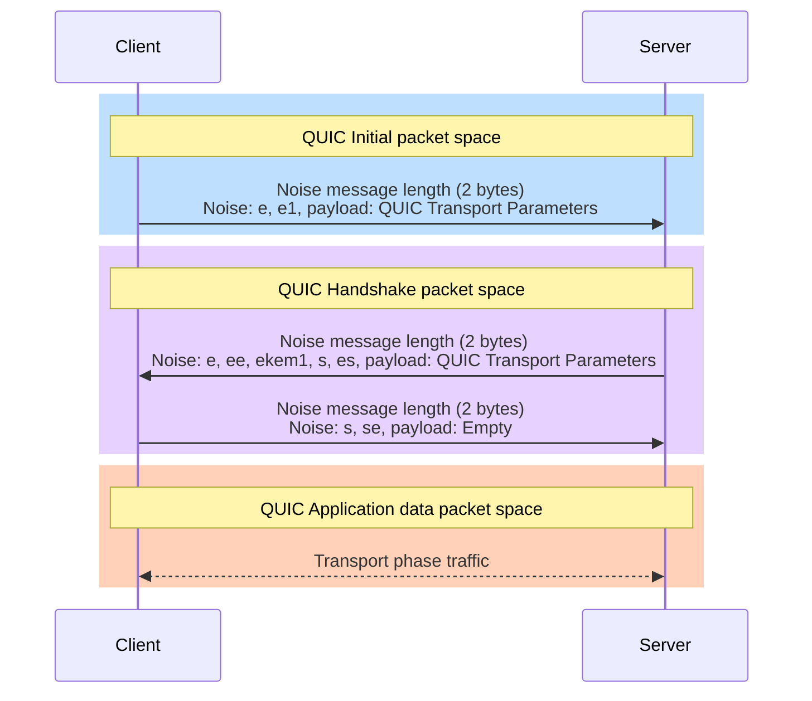

# nsq

A client/server network protocol for serving Nushift apps.

## Overview

It should be as easy to start a secure server serving Nushift apps as it is to start an SSH server.

This requirement is the reason for creating a new protocol.

A TOFU (trust-on-first-use) scheme is used. When a server is first started, a key is randomly generated. When a client first connects to a server, it accepts the key with no prompt to the user. On subsequent attempts, if the key has changed then a warning is shown.

## Protocol

[QUIC](https://www.rfc-editor.org/rfc/rfc9000.html) and [HTTP/3](https://www.rfc-editor.org/rfc/rfc9114.html) are used, with the underlying crypto in the QUIC CRYPTO frames being swapped out from TLS to [Noise](https://noiseprotocol.org/noise.html).

An ephemeral post-quantum exchange was added to the Noise handshake pattern through [Noise HFS](https://github.com/noiseprotocol/noise_hfs_spec/blob/025f0f60cb3b94ad75b68e3a4158b9aac234f8cb/output/noise_hfs.pdf).

XXhfs is the pattern being used at the moment.

Finally, a curve with higher security margins was chosen. Therefore, the final Noise protocol name is `Noise_XXhfs_448+Kyber1024_ChaChaPoly_BLAKE2b`.

## Handshake phase

Here is a diagram outlining the messages in the handshake phase:

In the messages, the Noise message length is included because the post-quantum keys and ciphertexts make the messages so huge (1700-2000 bytes per post-quantum message) as to not fit in a single UDP datagram anymore. And QUIC does not give us the ability to otherwise signify the end of a message within a stream beyond the stream abstraction it does give us.

### Initial keys

The keys used for the QUIC packet protection layer in the QUIC Initial packet space are derived as in [RFC 9001](https://www.rfc-editor.org/rfc/rfc9001.html#initial-secrets), except, instead of [HKDF-Expand-Label from TLS 1.3](https://www.rfc-editor.org/rfc/rfc8446.html#section-7.1) being used, only HKDF-Expand is used, with the strings "client in"/"server in" simply forming the `info` for HKDF-Expand rather than the `label` for HKDF-Expand-Label. The reason being, it is not relevant for us to use the string "tls13" which is in the definition of HKDF-Expand-Label, and also avoids other complexity that HKDF-Expand-Label introduces, namely the encoding of multiple fields and length encodings of those fields, of a struct into `info`.

The QUIC Transport Parameters in this first message are effectively unencrypted as is the case in TLS 1.3.

### Handshake keys

Ideally, I don't want to use the Handshake packet space, and just rely on Noise's protection. However, it is needed for `quinn` to work, and specifically, even the second message needs to be in this space for `quinn` to work (not only the last message).

So, we derive "keys" after the first message from calling `Split()` on the Noise state. This is in contrast to TLS 1.3, where Handshake keys are derived after the DH exchange and thus do provide protection. I.e., in TLS 1.3 the second UDP datagram contains an Initial QUIC packet with just the server ephemeral key and a Handshake QUIC packet with the remainder of the data which is protected. We cannot do this approach because the `snow` Noise library does not allow partially processing a Noise message.

Like TLS 1.3, the server QUIC Transport Parameters here are protected, due to Noise's protection.

## Transport phase

TODO
